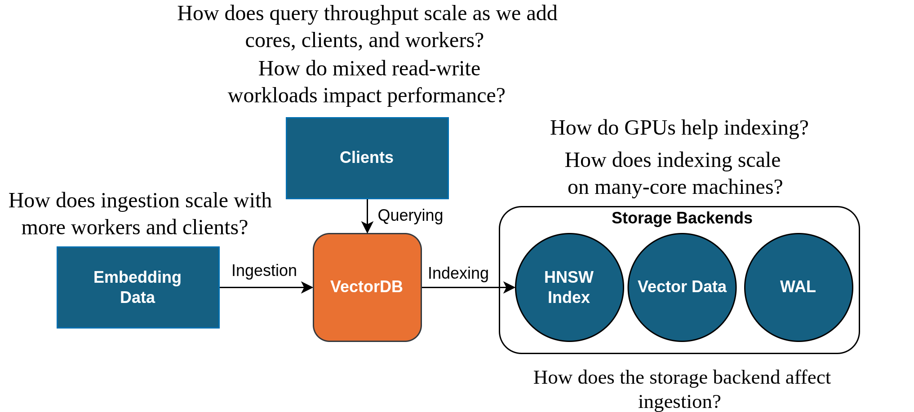

# HPC-VectorBench

HPC-VectorBench is a work-in-progress tool for running vector database (VDB) experiments on PBS HPC platforms that support Apptainer and MPI. Using `pbs_submit_manager.sh` and configuration files, users can launch customized single- and multi-node experiments to evaluate key aspects of VDB performance. The goal is to help users answer questions about performance on their target HPC platform. We focus on a few of the key stages of the VDB lifecycle, including data ingestion, index construction, and query serving. Currently, we support [Qdrant](https://qdrant.tech/), [Milvus](https://milvus.io/), and [Weaviate](https://weaviate.io/).


<br> <br>

<p align="center">
  
</p>


## Start Here
Using simple configurations files or command line parameters, (e.g., [Weaviate query experiment file](weaviate/sampleConfigs/query_core_testing.env)), users can specify key parameters that the submit manager will use to generate an experimental directory. If the submit manager is called with `--generate-only` it will only generate the directory, otherwise it will submit the job to the PBS queue specified in the configuration file. To view the supported experimental parameters, consults the [configuration page](config-reference.md) in the documentation. 


```bash
./pbs_submit_manager.sh --help
./pbs_submit_manager.sh --help --engine qdrant
./pbs_submit_manager.sh --engine milvus --config path/to/run.env
./pbs_submit_manager.sh --generate-only --engine weaviate --config path/to/run.env
./pbs_submit_manager.sh --generate-only --engine weaviate --set QUERY_BATCH_SIZE=32
```

## Task-Driven Benchmarking  
We designed our benchmark to allow us to test different common VDB tasks. Each task isolates a different part of vector database behavior so performance can be evaluated more cleanly and compared across engines. 

* `INSERT`: measures data ingestion throughput, allowing users to test different storage mediums, batch sizes, clients per worker, and total workers

* `INDEX`: isolates index construction cost after the data has been inserted, enabling users to test different storage mediums, virtual-core availability, index parameters, and numbers of workers.

* `QUERY`: measures search latency and retrieval throughput on an already indexed collection, allowing users to test a variety of query parameters, performance with different numbers of cores, and scaling across multiple nodes.
* `MIXED`: evaluates concurrent read/write behavior under combined insert and query load. This task is in the process of being expanded upon. 


## A Focus on Modular Design
This repository is designed to be extensible to allow for new vector databases to be added. The core workflow is organized around a unified submit manager and a shared schema-driven configuration layer, so new engines can plug into the existing generation, staging, and submission flow. To add a new vector database, create a new folder and mirror the existing engine layout with the following files defined:

  - `engine.sh`
    * Implements the engine contract used by `pbs_submit_manager.sh`. This is where the engine registers itself, validates config, stages files into generated run directories, and tells the unified submit layer how to run the workflow.

  - `schema.sh`
    * Defines the engine-specific configuration variables and defaults. This is the source of truth for parameters exposed through `--help --engine <name>` and for any required engine-specific runtime settings.

  - `main.sh`
    * The PBS runtime entrypoint copied into generated run directories. It is responsible for launching the database on the target cluster, waiting for readiness, and invoking the client workload for the selected task.

  - `local_main.sh`
    * The local runtime entrypoint, if local mode is supported. This usually launches a loca container or standalone process and then runs the same staged client workflow without PBS.

  - `clients/`
    * Contains the client source and build helpers used to drive insert, index, query, or mixed workloads. The engine should stage the built binaries from here into generated run directories.

  - `scripts/`
    * Holds engine-specific helpers such as collection creation, readiness checks, status inspection, result summarization, or setup utilities that are needed by the runtime scripts.


## Docs

- [Repo overview](docs/overview.md)
- [Unified submit workflow](docs/unified-submit.md)
- [Config reference](docs/config-reference.md)
- [Qdrant engine docs](docs/engines/qdrant.md)
- [Milvus engine docs](docs/engines/milvus.md)
- [Weaviate engine docs](docs/engines/weaviate.md)


